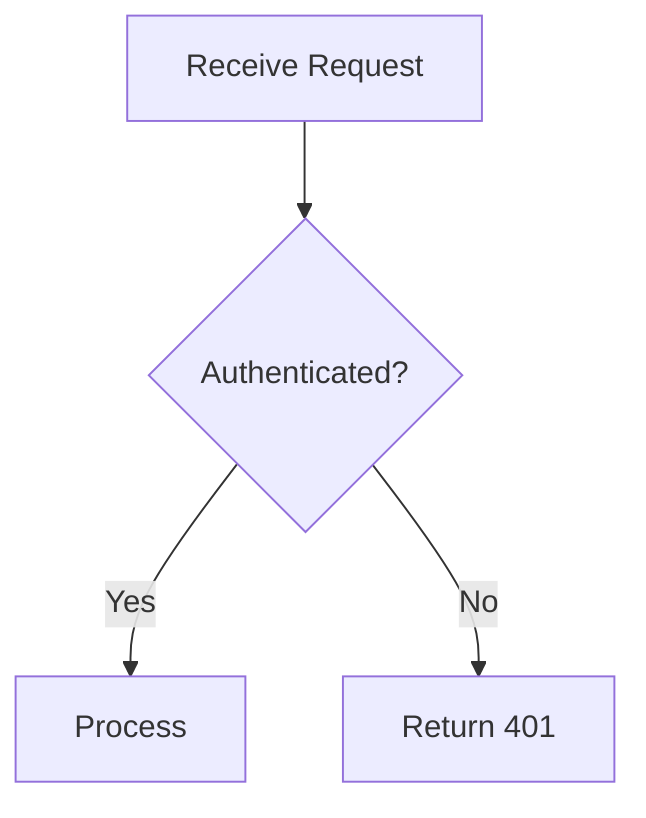

# Documentation Standards

For project-specific directory structure, practices, see [docs-structure.md](../../.opencastle/project/docs-structure.md).


## Issue Documentation Template

```markdown
### ISSUE-ID: Brief Description

**Issue ID:** ISSUE-ID
**Status:** Known Limitation | Fixed | Workaround Available
**Severity:** Critical | High | Medium | Low
**Impact:** [What user/developer experience is affected]

#### Problem
[Clear description of the issue]

#### Root Cause
[Technical explanation]

#### Solution Options
1. **Option A** — [Description] — Pros: ... Cons: ...
2. **Option B** — [Description]

#### Related Files
- `path/to/file.ts` — [What it does]
```

## Roadmap Update Template

When feature completed: add `COMPLETE` row with date, owner; list files changed with rationale; add validation command + exit status; move to `Completed` section with one-line release note.

```markdown
- Feature: Add priceRange filter
  Completed: 2026-03-30 | Owner: @developer
  Files: src/components/PriceRangeFilter.tsx, src/lib/filters.ts
  Validation: `pnpm build` (exit 0)
```

## Architecture Decision Record Template

```markdown
## ADR-NNN: Decision Title
**Date:** YYYY-MM-DD
**Status:** Accepted | Superseded | Deprecated
**Context:** [Why this decision was needed]
**Decision:** [What was decided]
**Consequences:** [Impact of the decision]
**Alternatives Considered:** [What else was evaluated]
```

## README Template

```markdown
# Feature / Library Name
One-sentence summary of what this does and why it exists.
## Quick Start
Brief usage example or setup steps.
## Architecture
High-level overview. Include Mermaid diagram for non-trivial systems.
## Key Files
| File | Purpose |
|------|---------|
| `src/handler.ts` | Request handling logic |
| `src/schema.ts` | Validation schemas |
```

## Mermaid Diagrams

Keep diagrams focused — one concern per diagram, max 10–12 nodes.



- `flowchart TD` for pipelines, `LR` for request flows, `sequenceDiagram` for API flows, `erDiagram` for data models
- Add `%% Title: ...` on complex diagrams; use verb labels on arrows

## Changelog Entry Template

Group entries by Conventional Commits type under version heading:

```markdown
## [1.2.0] — YYYY-MM-DD
### Added
- feat: Add retry logic to API client (#123)
### Fixed
- fix: Resolve race condition in queue processor (#127)
### Changed
- refactor: Extract validation into shared module (#125)
```

- One line per change; reference PR or issue number
- Imperative mood; most recent version first

## Documentation workflow

1. **Draft** — create doc using templates above.
2. **Validate** — run checks:
   ```bash
   npx markdown-link-check docs/**/*.md && pnpm prettier --check "docs/**/*.md"
   ```
   - Fail → fix broken paths/formatting → re-run step 2.
3. **Review** — peer review via PR; address comments.
4. **Publish** — merge; update roadmap/changelog.
5. **Pre-Merge Checklist** — accuracy ✓, links resolve ✓, front matter valid ✓, no TODO placeholders ✓, formatting consistent ✓.


## Writing, Formatting & Anti-Patterns

See [WRITING-GUIDE.md](WRITING-GUIDE.md) for writing guidelines, formatting rules, anti-patterns.
